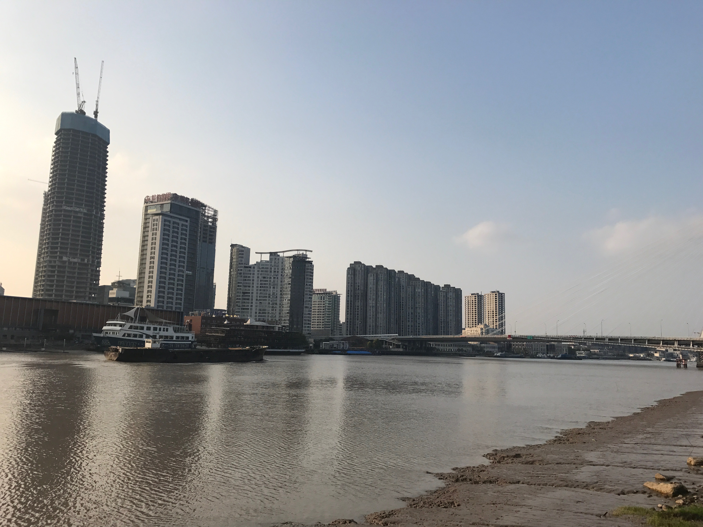
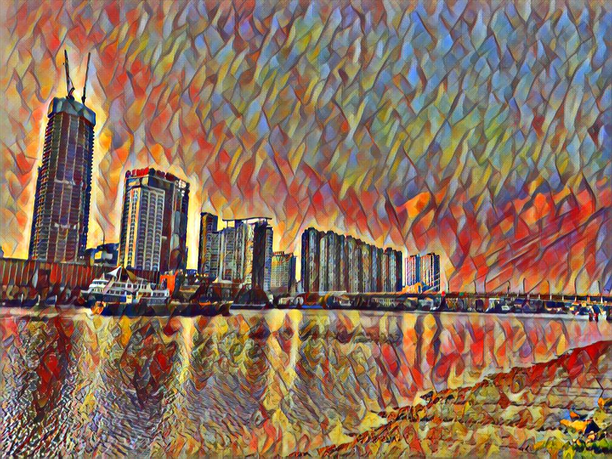
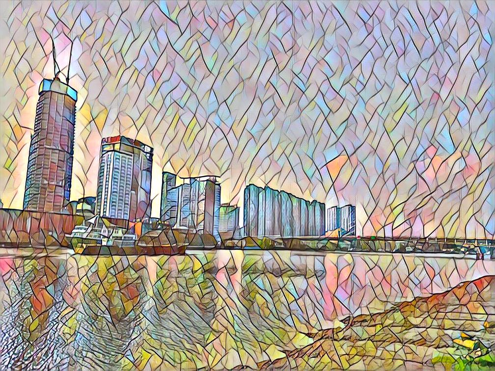
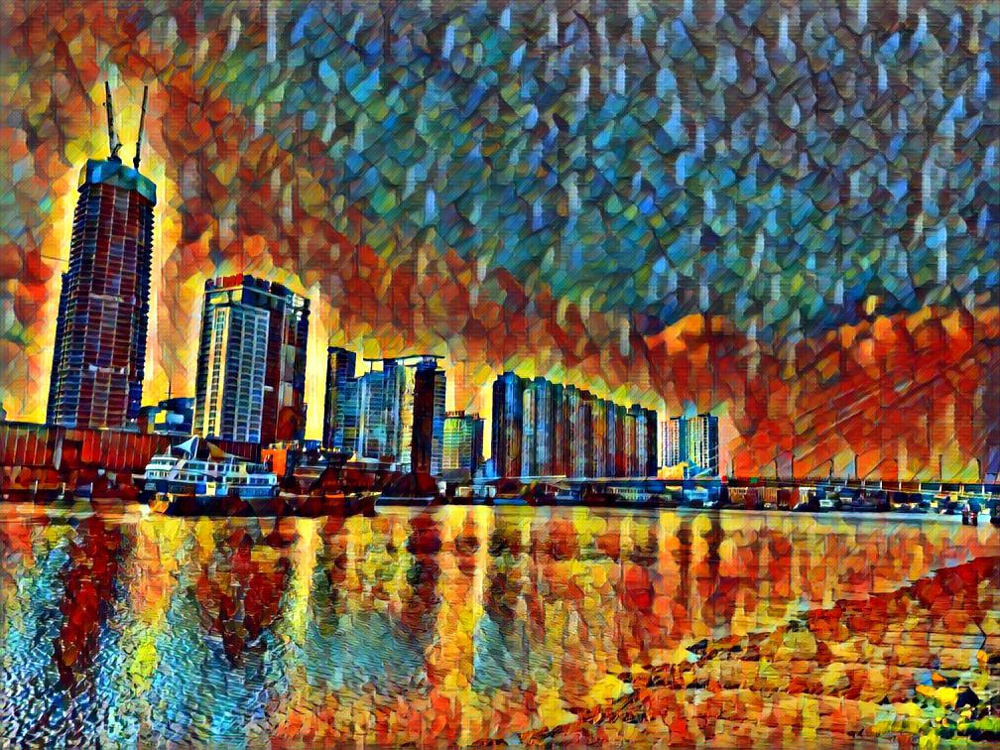
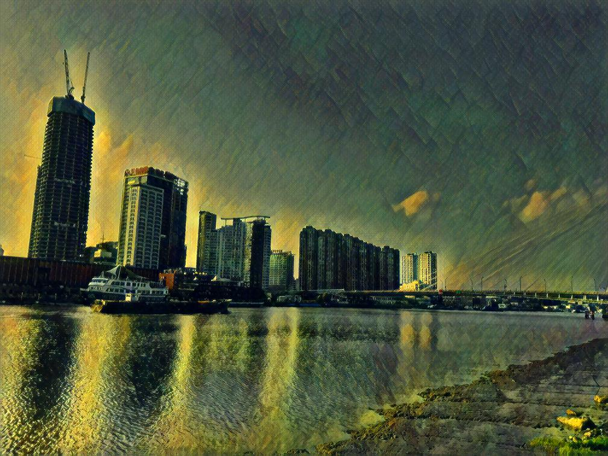
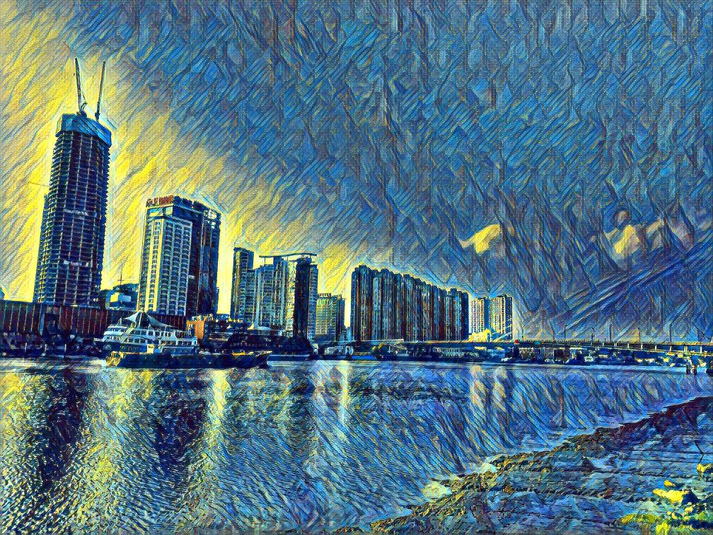
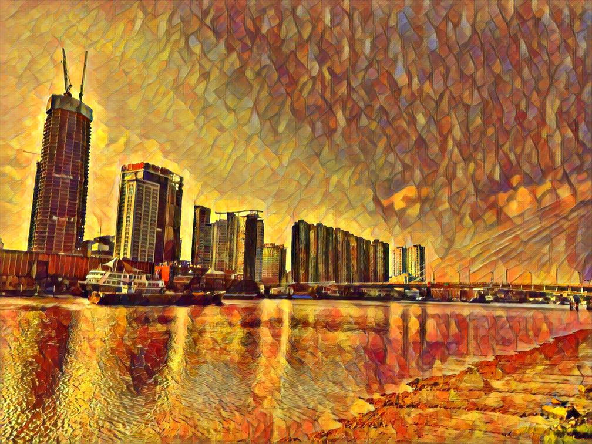
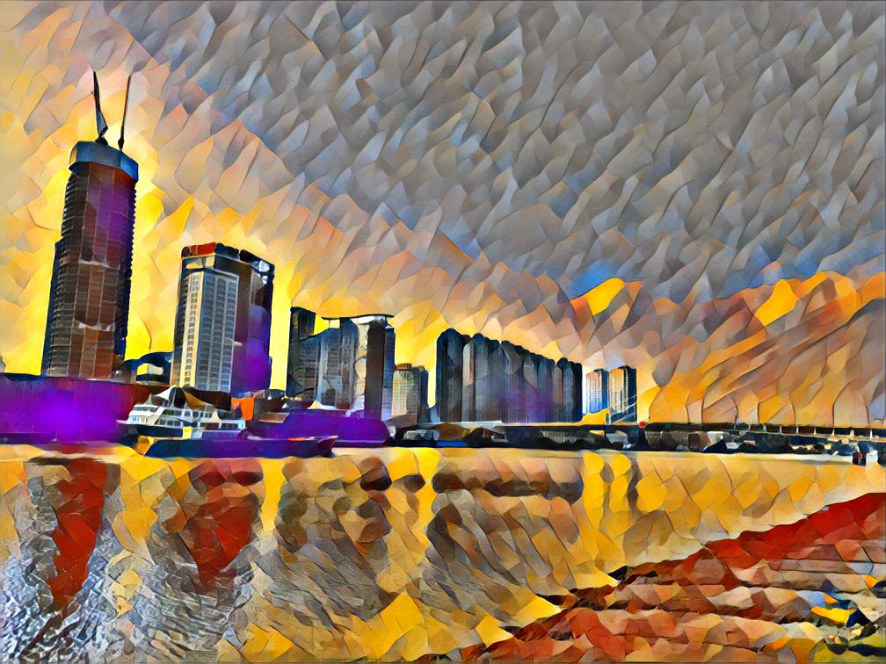
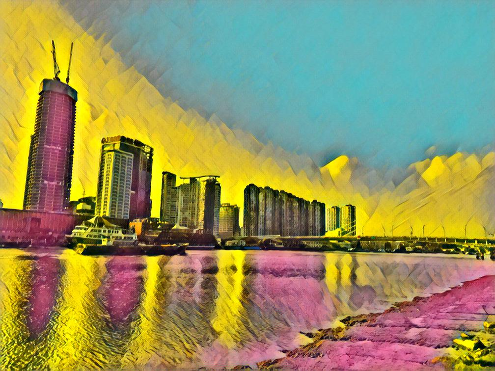

# pytorch multiple style transfer

Built based on the pytorch [fast-neural-style](https://github.com/pytorch/examples/tree/master/fast_neural_style) example for artistic style transfer, this repository try to re-implemented *Conditional Instance Normalization* layers to train transfer network with **multiple** style images at the same time. What I did here is basically replaced all *instance normalization* layers in [fast-neural-style](https://github.com/pytorch/examples/tree/master/fast_neural_style) with *conditional instance normalization* layers

*Conditional Instance Normalization* was introduced in [A Learned Representation For Artistic Style](https://arxiv.org/abs/1610.07629) and implemented with [Google Magenta TensorFlow](https://github.com/tensorflow/magenta/tree/master/magenta/models/image_stylization). I first learned this paper while reading [Joel Moniz Lasagne and Theano implementation](https://github.com/joelmoniz/gogh-figure). The creation and usage of the method in this repository is based on my limit knowledge in python, pytorch and neural network. 

## Usage

Please refer to [fast-neural-style](https://github.com/pytorch/examples/tree/master/fast_neural_style) for more details. 

Train
```
python neural_style.py train --dataset </path/to/train-dataset> --style-image </path/to/style/image> --save-model-dir </path/to/save-model/folder> --epochs 2 --cuda 1 --batch-size 4
```
* `--style-image`: the code will grab all files under the path as style images
* `--batch-size`: number of images fed in each batch does not need to be the same to the number of style images

Stylize 
```
python neural_style.py eval --content-image </path/to/content/image> --model </path/to/saved/model> --output-image </path/to/output/image> --cuda 0 --style-num 19 --style-id 18
```
* `--dataset`: path to training dataset, the path should point to a folder containing another folder with all the training images
* `--style-num`: total number of style images, must be the same as the amount used in training
* `--style-id`: a number from `0` to `style_num - 1`, indicating which style to transfer to


## Results

### Training content image datasets

[COCO 2014 Training images dataset [83K/13GB]](http://images.cocodataset.org/zips/train2014.zip)

### Training style images

I used 19 style images, most of which are from other great style-transfer-related Github repos I read through:
* [pytorch fast-neural-style](https://github.com/pytorch/examples/tree/master/fast_neural_style/images/style-images)
* [jcjohnson](https://github.com/jcjohnson/fast-neural-style/tree/master/images/styles)
* [hwalsuklee](https://github.com/hwalsuklee/tensorflow-style-transfer/tree/master/images)

### Pretrained model

Model used in the following examples can be found in the **pytorch_models** folder

<div align='center'>
  		
</div>

<div align='center'>
  
  
  
  
  
  
  
  
  
  
  
  
  
  
  
  
  
  
  
</div>
